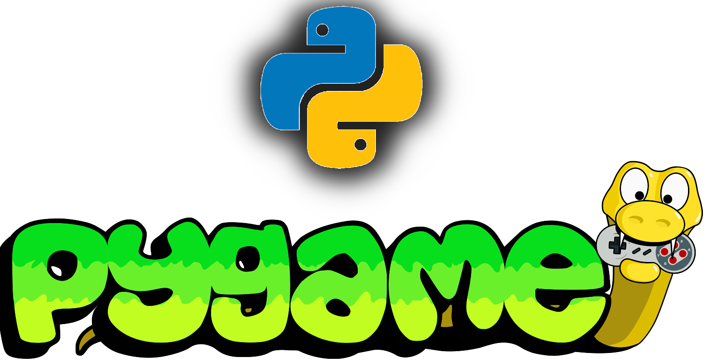

# My Projects

**Español:** [Ver README en español](README_es.md)

## About me

- Hi, I'm **Antonio Castro**. I am retired, but I enjoy programming in Python, specifically using the Pygame library.
- I enjoy learning new things at my own pace. I’m starting to share some of my projects, generally under the MIT license.

## What I do nowadays

- I have built several games and simulators, and after trying various auxiliary libraries to complement Pygame’s functionality, I decided to develop my own libraries.
- I have been developing locally for several years with Pygame, and I’m very satisfied with my libraries. That is why I decided to share them on GitHub.
- I have been using Git and GitHub for a short time, but that is not a problem. I use ChatGPT quite a lot to assist me both with programming tasks and with learning technologies that I do not yet master and want to learn.

## Links to my projects

- On GitHub
  - [form_core_pygame (Lib)](https://github.com/acastr008/form_core_pygame)
  - [help_core_pygame (Lib)](https://github.com/acastr008/help_core_pygame)
  - [cardumen (Game)](https://github.com/acastr008/cardumen)
- On PyPI (libraries)
  - [PyPI - acatro0841](https://pypi.org/user/acastro0841)

## In the future

There are still important things I want to share: games, simulation programs, and libraries for Pygame. The process of adapting my projects to publish them on GitHub and documenting them is slow, but steady.

